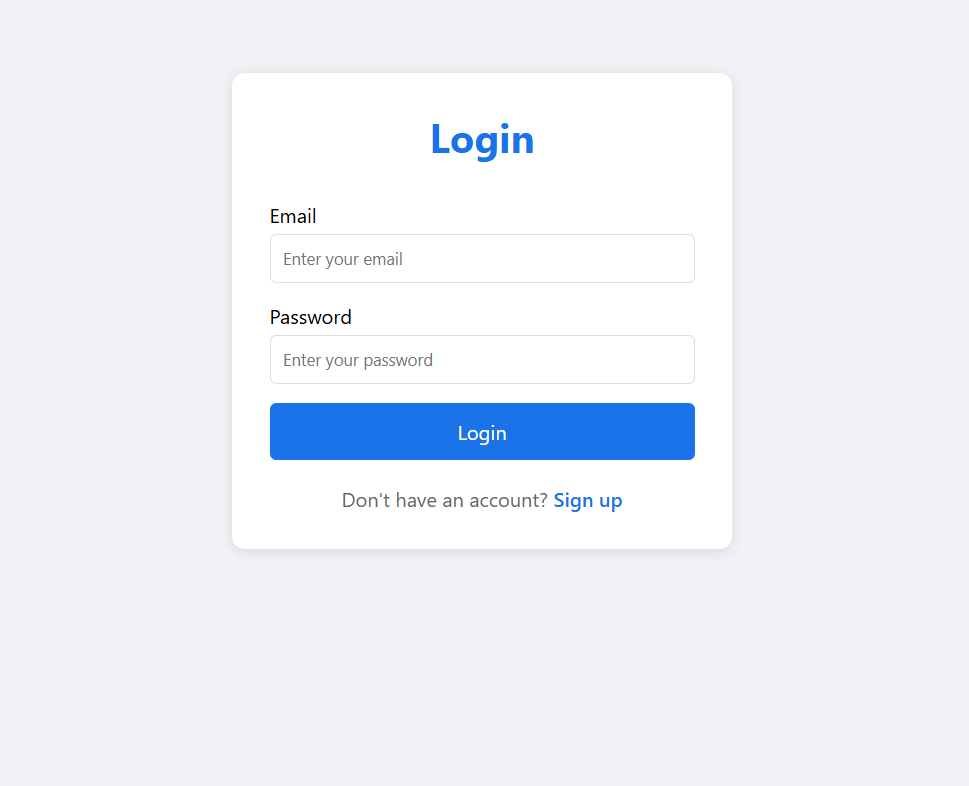
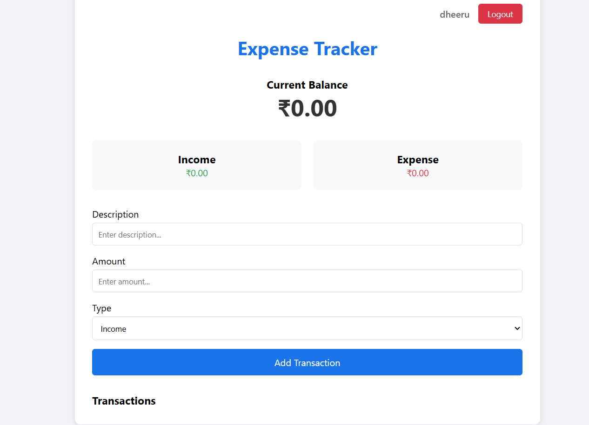

# Brainwave_Matrix_Intern
# Expense Tracker

A modern web-based expense tracking application built with HTML, CSS, and JavaScript. This application helps users manage their personal finances by tracking income and expenses in a clean, intuitive interface.

## Features

- User Authentication (Login/Signup)
- Track Income and Expenses
- Real-time Balance Calculation
- Categorization of Transactions
- Responsive Design
- Local Storage for Data Persistence
- Secure Password Handling
- User-friendly Interface


## Screenshots




## Getting Started

### Prerequisites

- Modern web browser (Chrome, Firefox, Safari)
- Node.js (for development server)

### Installation

1. Clone the repository:
```bash
git clone [https://github.com/dheerubaba123/expense-tracker.git](https://github.com/dheerubaba123/expense-tracker.git)
cd expense-tracker
